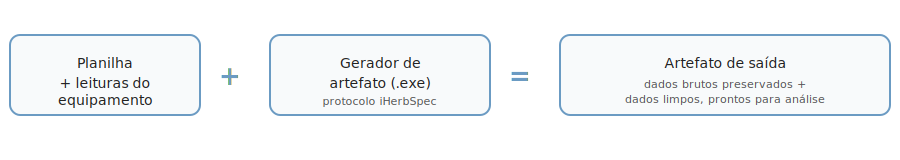

# herbflow NIR Collection Kit

O **herbflow** reúne duas ferramentas para testar o fluxo de coleta de dados
espectrais (NIR) de espécimes de herbário: uma **planilha** para registrar os
metadados da coleta (`herbflow_iHerbSpec.xlsm`) e um **gerador de artefato**
que junta a planilha preenchida com as leituras do equipamento
(`iherbspec_parser.exe`), produzindo um pacote de dados organizado e pronto
para arquivar/compartilhar.

O herbflow não depende de um protocolo específico — nesta fase de teste
usamos o **iHerbSpec (v1.2.1)** como protocolo de referência. Esta é uma
versão de **teste de fluxo**: o objetivo é validar com pessoas reais em campo
se o caminho planilha → coleta → parser funciona bem na prática, não entregar
um produto final.

## 📖 Guia de uso completo

O passo a passo detalhado (requisitos, desbloqueio do `.xlsm`, a coleta, o
parser, o artefato de saída) está no **[guia de uso online](https://darthgrogu.github.io/herbflow-nir-collection-kit/)**.
O mesmo guia também vai dentro do pacote de teste, pra consulta offline.

## ⬇️ Baixe o pacote de teste

**Não é necessário clonar ou baixar o código deste repositório.** Pegue o
`.zip` mais recente na aba [Releases](../../releases) — ele já traz a
planilha (`.xlsm`), o gerador de artefato (`.exe`), dois datasets de exemplo
prontos para testar sem precisar de equipamento, e o guia de uso completo
(abra o atalho `Guia de Uso.html` na raiz do pacote).

## Algo deu errado no seu teste?

Anote o que você tentava fazer, o que apareceu na tela, e — se possível — o
arquivo de relatório que o gerador produz (`RELATORIO.html` ou
`RELATORIO_REJEICAO.md`, dentro da pasta de saída). Mande para quem te
enviou o pacote, ou abra uma [Issue](../../issues) neste repositório.

## Licença

O código deste repositório (scripts de empacotamento e documentação) é
distribuído sob a licença MIT — veja [`LICENSE`](LICENSE). A planilha e o
gerador de artefato vêm de dois projetos separados, com seu próprio
histórico e decisões de licenciamento.
