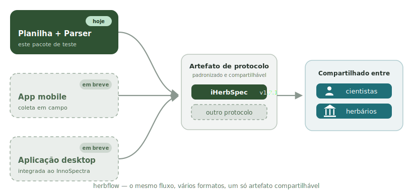

# Entendendo o fluxo

Olá! Se é sua primeira vez por aqui, esta página explica com calma o que é o
**herbflow**, o que tem dentro deste pacote e para onde o fluxo está indo — sem
pressa. Para já colocar a mão na massa com dados de exemplo, veja
[Comece por aqui](test-drive.md).

## O que é o herbflow

O **herbflow** é o fluxo de coleta em si — registrar os metadados de cada
espécime, coletar as leituras espectrais no equipamento e transformar tudo num
artefato padronizado, pronto para arquivar e compartilhar. Ele não depende de
um formato único de ferramenta: é o mesmo fluxo, esteja ele numa planilha, num
app ou num equipamento integrado.

## As duas ferramentas deste pacote

Nesta primeira forma do fluxo, o herbflow reúne duas ferramentas usadas para
testar o caminho de coleta de ponta a ponta:

- **Planilha de coleta** (`herbflow_iHerbSpec.xlsm`) — usada durante a coleta
  em campo/bancada para registrar os metadados de cada leitura (espécime,
  sessão, instrumento, tipo de tecido, etc.).
- **Gerador de artefato** (`iherbspec_parser.exe`) — depois da coleta, junta a
  planilha preenchida com os arquivos de leitura do equipamento e produz o
  pacote final de dados, organizado e pronto para arquivar/compartilhar.

As duas ferramentas são **propositalmente independentes** — você roda a
planilha primeiro, depois roda o gerador de artefato manualmente, apontando-o
para os arquivos gerados durante a coleta. Não existe (ainda) comunicação
automática entre os dois; isso é intencional e faz parte do que este teste está
avaliando.

## O mesmo fluxo, vários formatos

A planilha + o gerador de artefato são a **primeira forma** do herbflow — a que
você testa hoje. O mesmo fluxo vai ganhar outros formatos:

- **App mobile** (em breve) — coleta em campo direto pelo celular.
- **Aplicação desktop** (em breve) — integrada ao equipamento InnoSpectra.

Todos levam ao **mesmo destino**: um artefato de protocolo padronizado,
compartilhável entre cientistas e herbários.

<figure markdown="span" class="hero-diagram">
  
</figure>

## Protocolo de referência

Nesta fase de teste usamos o **iHerbSpec (v1.2.1)** como protocolo de
referência: é o que a planilha preenche e o que o artefato de saída segue hoje.
O toolkit foi pensado para se adaptar a outros protocolos (outros campos, outros
formatos de saída), o que será ampliado nos próximos testes.

!!! note "Isto é um teste de fluxo, não o produto final"
    O objetivo é testar com pessoas reais em campo se o caminho planilha →
    coleta → parser funciona bem na prática — qualquer dificuldade ou confusão
    que você encontrar é exatamente o tipo de feedback que este teste está
    procurando. O toolkit (e este guia) vai evoluir a partir do que testadores
    reais relatarem — **qualquer feedback seu é valioso** para o aprimoramento
    da ferramenta. Ver [Feedback](feedback.md).

## Por onde seguir

Agora que você já entende como o herbflow funciona, dá para seguir por dois
caminhos:

- **Fazer um primeiro teste com dados de exemplo** — sem coletar nada e sem
  precisar de equipamento, só para ver o fluxo inteiro funcionando. Veja
  [Comece por aqui](test-drive.md).
- **Começar seu primeiro teste real** — estruturando sua própria planilha de
  metadados e coleta. Vá para [1. Planilha (metadados)](planilha/index.md).
