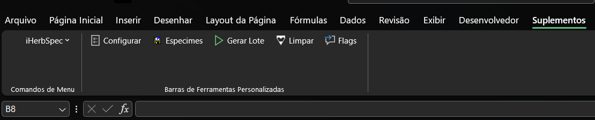

# Usando a planilha herbflow (coleta real)

Depois de desbloquear e habilitar as macros (passo anterior), um menu próprio
aparece na barra do Excel (chamado **iHerbSpec** nesta versão), com uma barra
de ferramentas correspondente. O fluxo de preparação da coleta segue esta
ordem:

1. **Configurar Sessão/Instrumento** — primeiro passo. Abre um formulário
   para definir o projeto, a sessão de coleta e os dados do instrumento
   (nome, modelo, número de série). O Session ID pode ser atualizado
   automaticamente ou definido manualmente aqui.
2. **Gerenciar Espécimes** — adicione os espécimes que serão medidos nesta
   sessão. O formulário aceita leitor de código de barras para acelerar a
   digitação do identificador de cada espécime.
3. **Criar Tabela por LOTE** — com sessão e espécimes configurados, este
   comando expande automaticamente todas as linhas de coleta esperadas (por
   espécime, por classe de leitura) na aba de dados.
4. **Coleta em campo** — com a tabela já gerada, você realiza as leituras no
   equipamento seguindo a ordem das linhas. Durante a coleta, use **Abrir
   Painel de Flags** para marcar anotações de qualidade da linha ativa
   (ex.: tecido com indumento denso, lâmina bulada, presença de nervuras
   proeminentes) sem precisar navegar pelas colunas manualmente.

Outros itens do menu, usados com menos frequência:

- **Atualizar Filenames (Linhas Selecionadas)** — recalcula o nome de arquivo
  esperado para as linhas selecionadas, útil depois de editar manualmente
  campos que entram nesse nome.
- **Atualizar Session ID (agora)** — força a atualização do identificador de
  sessão para o timestamp atual.
- **Limpar Checkboxes / Normalizar Booleanos** — manutenção; normaliza campos
  booleanos que às vezes ficam com formatação inconsistente depois de copiar/
  colar.
- **Comentários dos Campos** — aplica anotações explicativas em cada
  cabeçalho de coluna (com submenu de idioma: Português, Español, English) —
  útil como referência rápida sobre o que cada campo espera.
- **Limpar tabela** — apaga todas as linhas da aba de dados para começar uma
  sessão nova do zero. Como é uma ação destrutiva, o Excel pede confirmação
  antes de executar.

> Um HUD de coleta (painel flutuante espelhando a linha ativa) existe no
> código da planilha mas está desativado nesta versão — não é parte do fluxo
> ativo no momento.

Com a tabela de coleta gerada e a [pasta de leituras](pasta-de-leituras.md)
pronta ao lado da planilha, o próximo passo do fluxo é a
[coleta](../coleta/index.md) — operar o equipamento e salvar as leituras.
