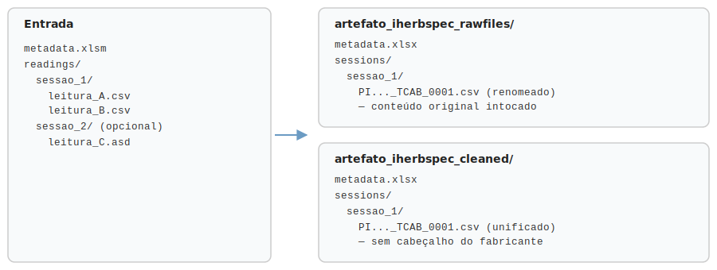

# Estrutura de pastas

O gerador produz, dentro da pasta de saída escolhida, uma subpasta
(`iherbspec_dataset_output/`, ou o nome que você definir no campo "Nome do
artefato"), contendo:

- **`artefato_iherbspec_rawfiles/`** — pasta com os arquivos de leitura
  originais do equipamento, **sem nenhuma alteração de conteúdo**, só
  renomeados para seguir a convenção de nomes do protocolo. Serve como cópia
  de segurança fiel ao que o equipamento realmente gravou.
- **`artefato_iherbspec_cleaned/`** (opcional — só se "Gerar também o
  artefato limpo" estiver marcado) — pasta com uma leitura unificada por
  arquivo (comprimento de onda + absorbância/reflectância, sem o cabeçalho
  específico do fabricante do equipamento), mais uma única tabela de
  metadados (`metadata.xlsx`) cobrindo todas as sessões do lote. É a forma
  pronta para análise.
- **`RELATORIO.html`** (lote aceito) ou **`RELATORIO_REJEICAO.md`** (lote
  rejeitado) — soltos ao lado das pastas acima, nunca dentro delas. Ver
  [Relatório de sucesso](relatorio-sucesso.md) e
  [Relatório de rejeição](relatorio-rejeicao.md).

Os arquivos dentro das duas pastas são organizados por sessão. Diferente de
versões anteriores deste kit, **os artefatos não são mais `.zip`** — são
pastas simples, para você poder abrir e conferir o resultado direto, sem
precisar extrair nada toda vez.

!!! info "O formato de saída segue o protocolo de referência"
    Os nomes de arquivo e a estrutura do artefato seguem hoje o **iHerbSpec**,
    o protocolo de referência desta fase. É o parser que define esse formato —
    outros protocolos (com outros campos ou outra convenção de nomes) podem
    ser adaptados a ele, o que será ampliado nos próximos testes.
