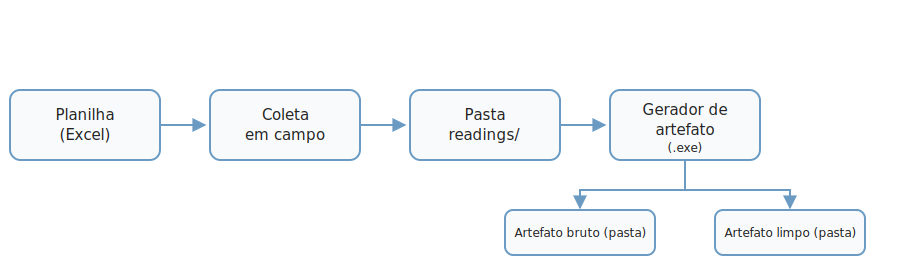

# Comece por aqui

Esta página serve a dois propósitos: entender o **fluxo completo** de ponta a
ponta e, logo em seguida, rodar um **primeiro teste real** — usando os dados de
exemplo que já vêm no pacote, sem coletar nada e sem precisar de equipamento.

## Visão geral do fluxo

O caminho completo tem 4 etapas, sempre nesta ordem:

1. **Planilha (metadados)** — você abre `herbflow_iHerbSpec.xlsm`, configura a
   sessão e os espécimes, gera a tabela de coleta e define a pasta `readings/`
   ao lado da planilha. Ver [1. Planilha (metadados)](planilha/index.md).
2. **Coleta** — com a planilha como guia, você opera o equipamento espectral e
   salva cada leitura na pasta `readings/`. Ver [2. Coleta](coleta/index.md).
3. **Conversão (Parser)** — o gerador de artefato lê a planilha + a pasta de
   leituras e converte tudo. Ver [3. Conversão (Parser)](parser/index.md).
4. **Artefato de saída** — duas pastas: uma com os dados **brutos** (arquivos
   originais, só renomeados) e outra com os dados **limpos** (leituras
   unificadas, prontas para análise). Ver
   [4. Artefato de saída](saida/index.md).

> As duas ferramentas nunca trocam dado diretamente — é sempre você quem leva
> a informação de uma pra outra (a planilha preenchida + a pasta de leituras).
> Isso é de propósito nesta fase de teste.

!!! tip "Quer entender o fluxo em detalhe antes?"
    Esta é a visão rápida, o suficiente para rodar o primeiro teste. Se quiser
    entender o herbflow a fundo — as duas ferramentas, para onde o fluxo está
    indo — veja [Entendendo o fluxo](entendendo-o-fluxo.md).

## Primeiro teste, usando datasets de exemplo

!!! note "Ainda não baixou o pacote?"
    [Baixe aqui](baixe-o-pacote.md) — você vai precisar dele (planilha, gerador
    de artefato e os datasets de exemplo) para seguir este primeiro teste.

A pasta `dataset_exemplo/` traz dois datasets reais prontos, um por equipamento
suportado — dá para testar o gerador de artefato sem precisar coletar nada:

- **`dataset_exemplo/innospectra-nir-s-g1/`** — planilha (`metadata.xlsm`) +
  leituras (`readings/`) de uma coleta real completa (14 espécimes, 88
  leituras).
- **`dataset_exemplo/fieldspec/`** — planilha (`metadata.xlsx`) + leituras
  reais de um segundo equipamento suportado (ASD FieldSpec).

!!! info "Estes datasets servem para testar o fluxo, não como modelo de preenchimento"
    Eles existem para você ver o **fluxo funcionando** de ponta a ponta — não
    são referência de **como preencher** a planilha. A forma de preencher
    (quais campos são obrigatórios ou opcionais, como descrever cada um, entre
    outros detalhes) varia conforme o **protocolo** e conforme cada **herbário
    ou grupo de pesquisa**. O objetivo final é sempre o mesmo: um **artefato
    padronizado**.

!!! warning "Dataset do FieldSpec tem campos placeholder"
    Especificamente no dataset do FieldSpec, alguns campos da planilha ainda
    são **placeholders** — valores não confirmados: `targetClass`,
    `backgroundClass`, `instrumentModel`/`instrumentSerialNumber` e
    `sessionId`.

Passo a passo, com qualquer um dos dois datasets:

1. Abra `iherbspec_parser.exe`.
2. Em "PASSO 1. Planilha de metadados", escolha a planilha do dataset
   (`metadata.xlsm` ou `metadata.xlsx`).
3. O programa detecta a pasta `readings/` automaticamente (ela está do lado
   da planilha) e mostra o resultado da conferência.
4. Em "PASSO 3. Geração do artefato dataset iHerbSpec", escolha uma pasta de
   saída e clique em gerar.

Pronto — você já viu o fluxo completo funcionando antes de fazer sua própria
coleta. A partir daqui, você pode:

- **Explorar o artefato que este teste gerou** — para entender o que sai do
  fluxo, veja [Artefato de saída](saida/index.md).
- **Começar uma coleta real** — vá para
  [1. Planilha (metadados)](planilha/index.md) e comece a estruturar sua
  própria planilha de metadados e coleta.
